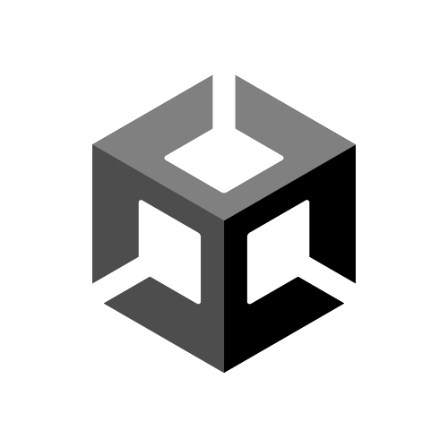

# zakiandiga
 
### Summary
A game developer/designer with years of professional production/project management experience.

### :hammer_and_wrench: Tools for Trades

  
  
  
  
  
  (https://twinery.org/)

  
  

 

  
   

### :video_game: Links

*[**My Itch.io**](https://static.itch.io/images/logo-white-new.svg)  
*[**My Game Design Documents Compilation**](https://app.milanote.com/1Nl8651I9p2Uda?p=VXErRkFthAc)  
